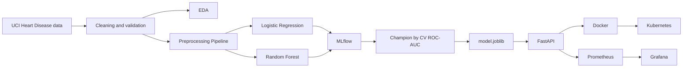
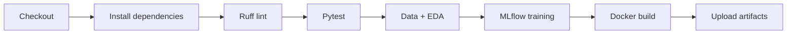

# Heart Disease MLOps Assignment - AIML ZG523

End-to-end MLOps implementation for the **UCI Cleveland Heart Disease** classification problem. The repository covers data acquisition and EDA, reusable preprocessing, two tuned classifiers, MLflow experiment tracking, reproducible model packaging, automated tests, GitHub Actions CI, FastAPI serving, Docker, Kubernetes deployment, Prometheus/Grafana monitoring, and a simple drift check.

> **Educational use only.** This model is not a medical device and must not be used for diagnosis or treatment decisions.

## Architecture



The stack is deliberately aligned with the course syllabus: MLflow for experimentation, model serialization and containerization, microservice model serving, Kubernetes-style deployment, production monitoring/observability and drift detection.

## Repository structure

```text
.
├── .github/workflows/ci.yml
├── artifacts/
│   ├── metrics/
│   ├── model/
│   └── plots/
├── data/
│   └── README.md
├── k8s/
├── monitoring/
├── notebooks/
├── report/ASSIGNMENT_REPORT.md
├── screenshots/README.md
├── scripts/download_data.py
├── src/
│   ├── api/
│   ├── monitoring/
│   ├── data.py
│   ├── eda.py
│   ├── preprocessing.py
│   └── train.py
├── tests/
├── Dockerfile
├── docker-compose.yml
├── requirements.txt
├── MODEL_CARD.md
├── SUBMISSION_CHECKLIST.md
├── VIDEO_SCRIPT.md
└── sample_request.json
```

## Clean setup

Python 3.11 is recommended.

```bash
python -m venv .venv
# Linux/macOS
source .venv/bin/activate
# Windows PowerShell
# .venv\Scripts\Activate.ps1

python -m pip install --upgrade pip
pip install -r requirements.txt
```

## Data acquisition and EDA

```bash
python scripts/download_data.py
python -m src.eda
```

The download script retrieves the Cleveland data from UCI with a public mirror fallback. `?` values are parsed as missing, and the original `num` outcome is converted to a binary target (`0` = no disease, `1-4` = disease present). The processed CSV is generated deterministically at `data/processed/heart_clean.csv`.

EDA generates feature histograms, a correlation heatmap, class balance, missing-value counts and summary statistics.

## Training and MLflow

Start MLflow:

```bash
mlflow ui --backend-store-uri ./mlruns --port 5000
```

Train and track experiments:

```bash
python -m src.train --tracking-uri file:./mlruns
```

The training job uses an 80/20 stratified train/holdout split and 5-fold stratified cross-validation. Preprocessing is contained inside the scikit-learn Pipeline so imputation, encoding and scaling are fitted only on training folds.

### Reference results

| Model | CV Accuracy | CV Precision | CV Recall | CV ROC-AUC | Test Accuracy | Test Precision | Test Recall | Test ROC-AUC |
|---|---:|---:|---:|---:|---:|---:|---:|---:|
| Logistic Regression | 0.8470 | 0.8783 | 0.7838 | **0.9065** | 0.8689 | 0.8125 | 0.9286 | 0.9578 |
| Random Forest | 0.8179 | 0.8083 | 0.8008 | 0.8961 | **0.8852** | 0.8182 | **0.9643** | **0.9589** |

The champion is **Logistic Regression**, selected by the predeclared rule of highest mean 5-fold CV ROC-AUC. The holdout is not used to choose the winner. After selection, the champion pipeline is refit on all cleaned data and persisted as `artifacts/model/model.joblib`.

## Tests and lint

```bash
ruff check src tests scripts
pytest -q
```

The tests cover target construction/data cleaning, preprocessing with missing/categorical values, and the FastAPI prediction contract.

## Run the API locally

```bash
uvicorn src.api.main:app --host 0.0.0.0 --port 8000
```

Health check:

```bash
curl http://127.0.0.1:8000/health
```

Prediction:

```bash
curl -X POST http://127.0.0.1:8000/predict \
  -H "Content-Type: application/json" \
  -d @sample_request.json
```

Example response:

```json
{
  "prediction": 1,
  "label": "heart_disease_risk",
  "confidence": 0.539543,
  "model_name": "logistic_regression"
}
```

Prometheus metrics are exposed at `GET /metrics`. Request logs are structured JSON and intentionally do not record raw patient feature values.

## Docker and monitoring

Build only the API:

```bash
docker build -t heart-disease-api:1.0.0 .
docker run --rm -p 8000:8000 heart-disease-api:1.0.0
```

Or start API + Prometheus + Grafana:

```bash
docker compose up --build
```

- API: `http://localhost:8000`
- Prometheus: `http://localhost:9090`
- Grafana: `http://localhost:3000`

Useful PromQL:

```text
sum(rate(heart_api_requests_total[1m]))
histogram_quantile(0.95, sum(rate(heart_api_request_latency_seconds_bucket[5m])) by (le))
heart_predictions_total
```

## Kubernetes

Replace the image placeholder in `k8s/deployment.yaml`, then:

```bash
kubectl apply -f k8s/deployment.yaml
kubectl get pods,svc
```

For Minikube, run `minikube tunnel` for LoadBalancer access. The manifest includes two replicas, readiness/liveness probes, resource requests/limits and Prometheus scrape annotations.

## CI/CD

GitHub Actions runs on pushes to `main` and pull requests:



The workflow fails immediately on code/test/training/container errors and retains model/metrics/plots/MLflow outputs plus the generated cleaned dataset as workflow artifacts.

## Optional drift check

```bash
python -m src.monitoring.drift_check --current path/to/current_batch.csv
```

The provided KS-test check is a course demonstration signal, not a complete production retraining policy.

## Documentation and submission evidence

- Full report: [`report/ASSIGNMENT_REPORT.md`](report/ASSIGNMENT_REPORT.md)
- Model card: [`MODEL_CARD.md`](MODEL_CARD.md)
- Final evidence checklist: [`SUBMISSION_CHECKLIST.md`](SUBMISSION_CHECKLIST.md)
- Required screenshot list: [`screenshots/README.md`](screenshots/README.md)
- Video walkthrough script: [`VIDEO_SCRIPT.md`](VIDEO_SCRIPT.md)

Real screenshots of MLflow, successful GitHub Actions, Docker, Kubernetes, Prometheus/Grafana and the short video must be produced from the student's own execution environment rather than fabricated.

## Reproducibility notes

- Data preparation is deterministic.
- Preprocessing and prediction are stored in one fitted Pipeline.
- `random_state=42` is used where applicable.
- Dependencies are pinned.
- Model selection is fixed before viewing final holdout performance.
- GitHub Actions reproduces lint, tests, EDA, training and Docker build from a clean runner.

## Dataset citation

Janosi, A., Steinbrunn, W., Pfisterer, M., & Detrano, R. (1989). *Heart Disease* [Dataset]. UCI Machine Learning Repository. DOI: 10.24432/C52P4X.
