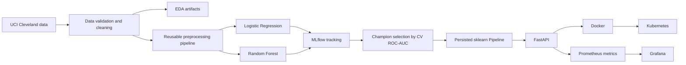

# MLOps Experimental Learning Assignment 01

**Course:** AIML ZG523 - Machine Learning Operations (MLOps)  
**Project:** End-to-End ML Model Development, CI/CD, and Production Deployment  
**Dataset:** UCI Heart Disease - Cleveland

## Executive Summary

This project implements a reproducible MLOps lifecycle for the UCI Cleveland Heart Disease dataset. Raw data is acquired and cleaned deterministically, exploratory analysis is generated programmatically, two classification pipelines are tuned and evaluated, experiments are tracked using MLflow, and the selected preprocessing-plus-model pipeline is saved as one deployable artifact. The model is exposed through a monitored FastAPI service, packaged in Docker, deployable to Kubernetes, and protected by an automated GitHub Actions quality gate.

The implementation intentionally stays within the AIML ZG523 course scope: model experimentation and metadata, MLflow, model serialization, containerization, model serving, Kubernetes-style deployment, production monitoring, observability and drift checking. Airflow/Kubeflow are syllabus topics, but scheduled orchestration is not a required Assignment 01 deliverable and is therefore not added merely for complexity.

> **Educational use only:** this model is not a medical device and must not be used for diagnosis or treatment decisions.

## 1. Solution Architecture and Syllabus Alignment

The course handout covers model experimentation, model versioning/metadata, model registry fundamentals, serialization and containerization; deployment and model serving; monitoring, observability and drift; and cloud/constrained-target deployment. The project therefore uses MLflow, a persisted scikit-learn pipeline, FastAPI, Docker, Kubernetes, Prometheus/Grafana and a lightweight drift check.



The central design principle is that preprocessing is never reimplemented in the serving API. The saved pipeline owns imputation, encoding, scaling and classification, which prevents training-serving skew.

## 2. Data Acquisition, Cleaning and EDA

The project uses the Cleveland subset of the UCI Heart Disease dataset with 303 records, 13 predictors and the original `num` outcome. The source uses `?` for some missing values. The implementation parses the canonical columns, converts values to numeric form, maps `num=0` to class 0 and `num in {1,2,3,4}` to class 1, removes the original outcome column, removes exact duplicate rows if present, and writes the cleaned data to `data/processed/heart_clean.csv`.

Missing predictor values are intentionally retained until model preprocessing so that imputation is fitted only on training folds. In the reference dataset, `ca` contains 4 missing values and `thal` contains 2.

The EDA stage generates histograms, a correlation heatmap, class-balance visualization, missing-value counts and summary statistics. Reference class counts are 164 records for class 0 and 139 for class 1, showing mild imbalance rather than an extreme skew.

Run:

```bash
python scripts/download_data.py
python -m src.eda
```

## 3. Feature Engineering and Model Development

Continuous variables `age`, `trestbps`, `chol`, `thalach`, `oldpeak`, and `ca` use median imputation followed by `StandardScaler`. Discrete/categorical variables `sex`, `cp`, `fbs`, `restecg`, `exang`, `slope`, and `thal` use most-frequent imputation and one-hot encoding with unknown-category tolerance.

Two required classifier families are evaluated:

- **Logistic Regression:** `C` in `{0.1, 1.0, 10.0}` and `class_weight` in `{None, balanced}`.
- **Random Forest:** 200 trees, `max_depth` in `{None, 5, 10}`, `min_samples_leaf` in `{1, 3}`, and `class_weight` in `{None, balanced}`.

The model-selection rule is fixed before final evaluation: choose the model with the highest mean 5-fold stratified cross-validation ROC-AUC on the 80% training split. The remaining 20% stratified holdout is used only for final reporting. `random_state=42` is used where applicable.

### Reference results

| Model | CV Accuracy | CV Precision | CV Recall | CV ROC-AUC | Test Accuracy | Test Precision | Test Recall | Test ROC-AUC |
|---|---:|---:|---:|---:|---:|---:|---:|---:|
| Logistic Regression | 0.8470 | 0.8783 | 0.7838 | **0.9065** | 0.8689 | 0.8125 | 0.9286 | 0.9578 |
| Random Forest | 0.8179 | 0.8083 | 0.8008 | 0.8961 | **0.8852** | 0.8182 | **0.9643** | **0.9589** |

Logistic Regression is selected because its mean CV ROC-AUC, 0.9065, is higher than Random Forest at 0.8961. Although Random Forest performs slightly better on the final holdout, changing the champion after seeing the holdout would contaminate test-set evaluation. After model selection, the Logistic Regression pipeline is refit on all cleaned records for serving.

## 4. Experiment Tracking and Reproducible Packaging

`src/train.py` integrates MLflow. Each model family is logged as a separate run under the `heart-disease-classification` experiment. Logged information includes hyperparameters, dataset row count, random state, fit time, cross-validation metrics, holdout metrics, ROC/confusion-matrix plots and the fitted scikit-learn model.

```bash
mlflow ui --backend-store-uri ./mlruns --port 5000
python -m src.train --tracking-uri file:./mlruns
```

The serving artifact is serialized with joblib as `artifacts/model/model.joblib`. `metadata.json` records the champion model, selection metric, best parameters, evaluation metrics, feature list and the fact that the production artifact was refitted on all cleaned data. Because preprocessing is contained in the same fitted pipeline as the estimator, inference uses exactly the same transformation logic as training.

## 5. Automated Testing and CI/CD

The repository contains unit and API tests for data cleaning/target construction, missing-value-safe preprocessing, and the `/predict` response contract. GitHub Actions runs on pushes to `main` and pull requests.

The CI sequence is:

1. Install pinned dependencies.
2. Lint `src`, `tests`, and `scripts` with Ruff.
3. Run Pytest and emit JUnit XML.
4. Download/prepare the UCI dataset and generate EDA artifacts.
5. Train and track both model candidates with MLflow.
6. Build the Docker image.
7. Upload model, metrics, plots and MLflow files as workflow artifacts.

A failing quality, test, data, training or Docker step fails the workflow and prevents later stages from being presented as successful.

## 6. FastAPI Model Serving and Docker

The service exposes:

- `GET /health` - liveness/readiness check.
- `POST /predict` - JSON prediction endpoint returning prediction, label, confidence and model name.
- `GET /metrics` - Prometheus-format operational metrics.

Example request:

```json
{
  "age": 63,
  "sex": 1,
  "cp": 4,
  "trestbps": 145,
  "chol": 233,
  "fbs": 1,
  "restecg": 2,
  "thalach": 150,
  "exang": 0,
  "oldpeak": 2.3,
  "slope": 3,
  "ca": 0,
  "thal": 6
}
```

Reference response:

```json
{
  "prediction": 1,
  "label": "heart_disease_risk",
  "confidence": 0.539543,
  "model_name": "logistic_regression"
}
```

Build and run:

```bash
docker build -t heart-disease-api:1.0.0 .
docker run --rm -p 8000:8000 heart-disease-api:1.0.0
```

The Docker image uses Python 3.11 slim, pinned dependencies and the persisted champion pipeline, and exposes port 8000 with a `/health` Docker health check.

## 7. Kubernetes Deployment

`k8s/deployment.yaml` defines a two-replica Deployment and a LoadBalancer Service. It includes readiness/liveness probes, CPU/memory requests and limits, and Prometheus scrape annotations.

```bash
# Replace YOUR_DOCKERHUB_USER in k8s/deployment.yaml first.
kubectl apply -f k8s/deployment.yaml
kubectl get pods,svc
```

For Minikube, `minikube tunnel` can be used so the LoadBalancer service receives a reachable address. Deployment evidence should show two Ready pods, the service, `/health`, and `/predict` through the Kubernetes endpoint.

## 8. Monitoring, Logging and Drift

The API exports request count, request latency and prediction-count metrics. Prometheus scrapes the service every five seconds in the Docker Compose stack, and the included Grafana dashboard can visualize request rate, P95 latency and prediction counts.

Useful PromQL examples:

```text
sum(rate(heart_api_requests_total[1m]))
histogram_quantile(0.95, sum(rate(heart_api_request_latency_seconds_bucket[5m])) by (le))
heart_predictions_total
```

Request logs are structured JSON and include request ID, method, path, status and latency. Raw patient feature values are deliberately not logged.

An optional `src/monitoring/drift_check.py` demonstration compares current and reference numeric-feature distributions using the two-sample Kolmogorov-Smirnov test. A p-value below 0.05 is flagged as potential drift. This is intentionally a demonstration signal rather than an automatic retraining policy.

## 9. Production-Readiness Discussion

The project emphasizes reproducibility through pinned dependencies, deterministic transformation, fixed seeds, in-pipeline preprocessing, a predeclared model-selection metric, automated tests and CI artifact retention. Kubernetes probes and resource constraints provide a minimal operational deployment pattern, while Prometheus/Grafana provide service-level observability.

The dataset is small, historical and geographically limited. A real healthcare deployment would require prospective validation, calibration, fairness/subgroup analysis, secure identity and access, encrypted transport, audit controls, data contracts, clinical governance and regulatory review. The model therefore remains an educational classifier only.

## 10. Deliverable Checklist and Conclusion

| Assignment task | Implementation | Status |
|---|---|---|
| Data + EDA | `scripts/download_data.py`, `src/eda.py`, generated plots/CSV | Complete |
| Feature engineering + models | `ColumnTransformer`, LR/RF tuning, 5-fold CV | Complete |
| Experiment tracking | MLflow parameters, metrics, artifacts and model logging | Complete in code; capture UI evidence |
| Packaging | joblib champion + metadata + pinned requirements | Complete |
| CI/CD + tests | Ruff, Pytest, training, Docker build, workflow artifacts | Complete in code |
| Containerization | FastAPI `/predict`, confidence, Dockerfile, sample input | Complete |
| Production deployment | Kubernetes Deployment + LoadBalancer + probes | Complete in code; capture runtime evidence |
| Monitoring/logging | JSON logs, Prometheus metrics, Grafana dashboard | Complete in code; capture dashboard evidence |
| Documentation | README, model card, this report, video/checklist guides | Complete |

The resulting repository demonstrates an end-to-end production-shaped MLOps lifecycle without adding unnecessary infrastructure outside the assignment scope. Its strongest reproducibility choices are the single preprocessing/model artifact, fixed champion-selection rule, deterministic data handling, experiment metadata, automated tests and CI quality gates.

### Evidence that must come from the student's own environment

Before final submission, capture real screenshots of MLflow, a successful GitHub Actions run, Docker `/predict`, Kubernetes pods/service and prediction, Prometheus and Grafana. Also add the final repository/deployment details and short pipeline video. The exact evidence list is maintained in `screenshots/README.md`.

## References

1. BITS Pilani WILP, AIML ZG523 MLOps Digital Learning Handout, Version 2.0, 05 July 2026.
2. BITS Pilani WILP, AIML ZG523 Assignment 01 problem statement, 2026.
3. Janosi, A., Steinbrunn, W., Pfisterer, M., & Detrano, R. (1989). *Heart Disease* [Dataset]. UCI Machine Learning Repository. DOI: 10.24432/C52P4X.
